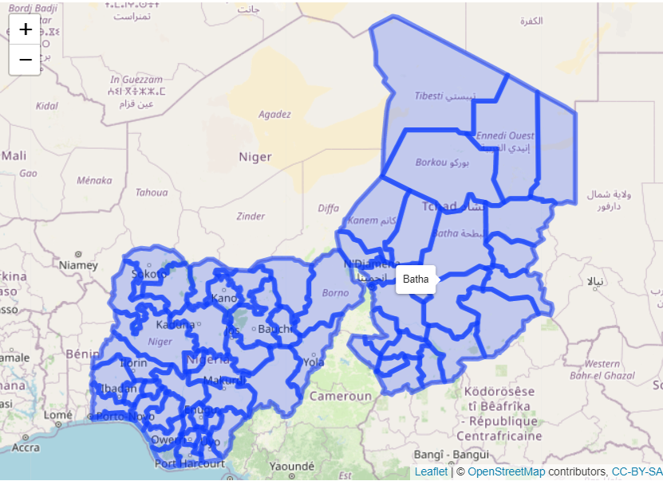
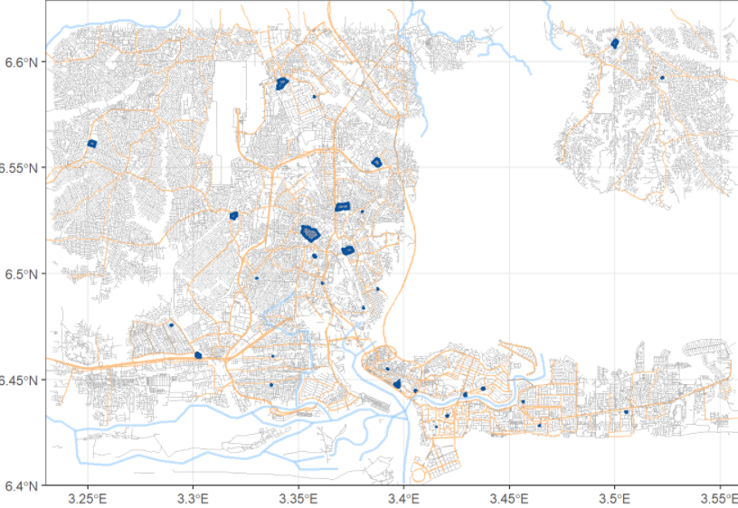
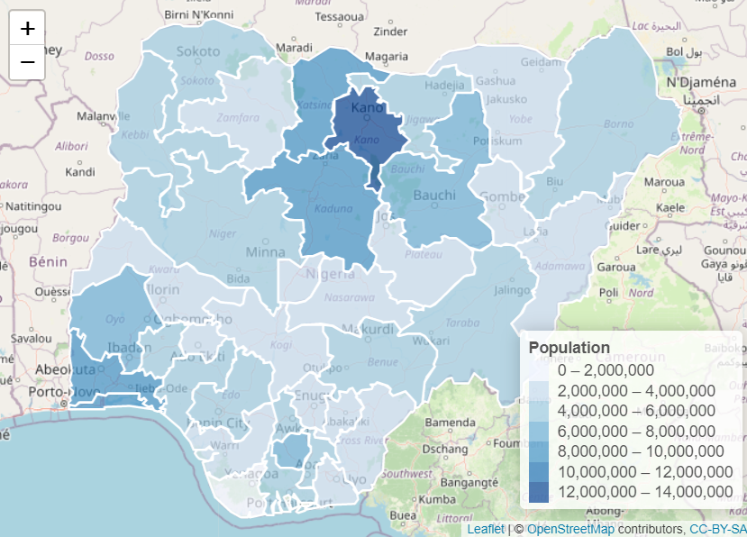
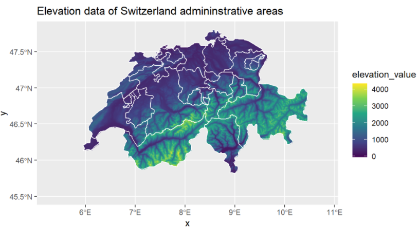
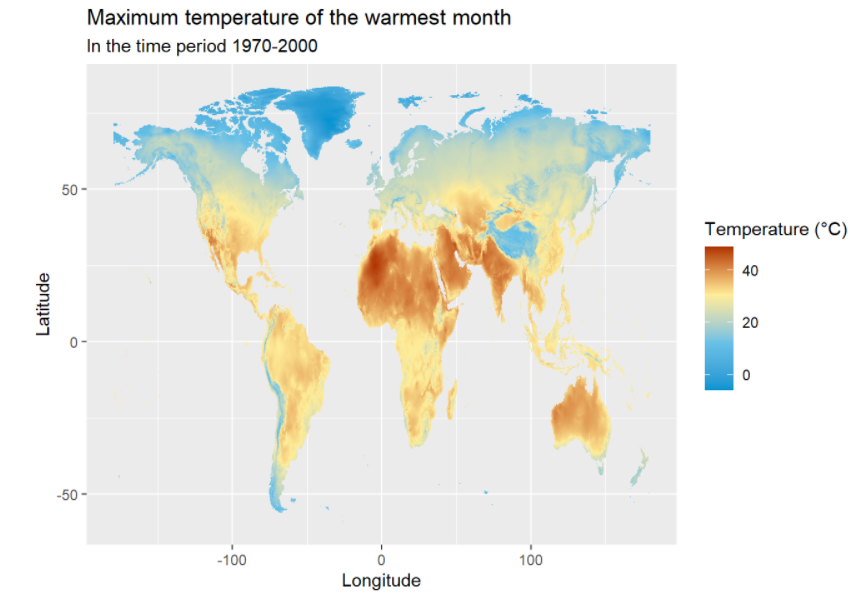
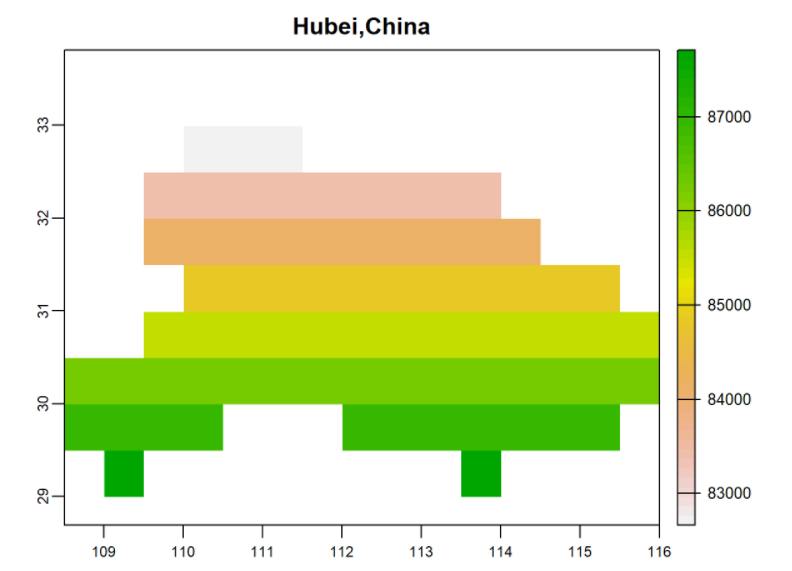
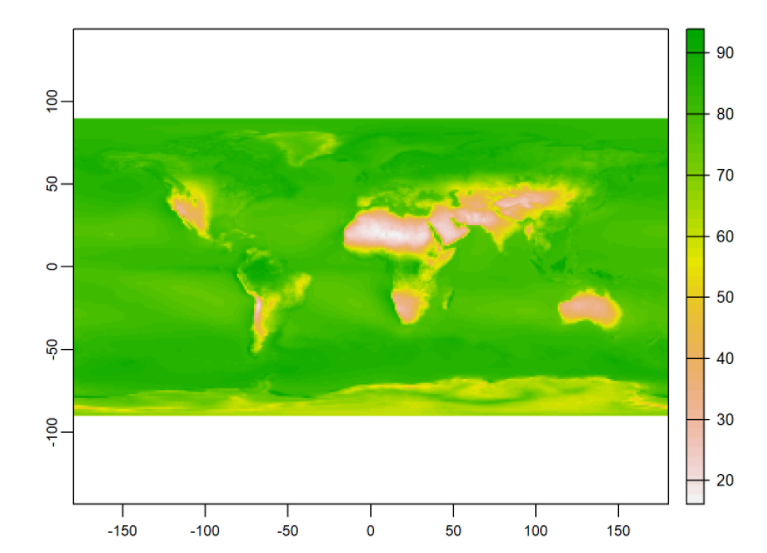
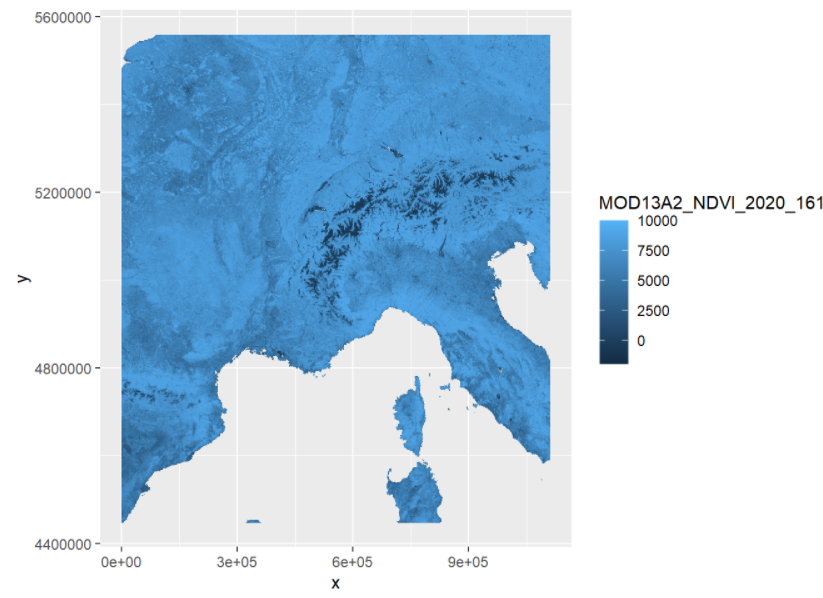
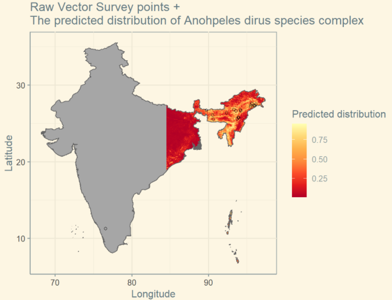

class:inverse

# About Us `r emo::ji("person_tipping_hand")`

.pull-left[

]

.pull-right[
[Dilinie Seimon](https://www.linkedin.com/in/dilinieseimon/)

.small-font[- Master of Business Analytics at Monash University
- BSc. in Information Technology and Management in Sri Lanka]
]


.pull-left[

]

.pull-right[
[Varsha Ujjinni Vijay Kumar](https://www.linkedin.com/in/varsha-ujjinni-vijay-kumar-1026121a4/)

.small-font[- Master of Business Analytics at Monash University
- Bachelor's in Information Technology and Engineering in India]
]

---

# Our Summer Vacation `r emo::ji("sun_with_face")`

--

`r emo::ji("woman_student")``r emo::ji("woman_technologist")` Visiting Students at [**KAUST**](https://www.kaust.edu.sa/en) (King Abdullah University of Science and Technology, Saudi Arabia)

--
class: animated,slideInRight

#### The Visiting Student Program at KAUST`r emo::ji("school")`

-  Aimed at offering research experience for international students while collaborating with their faculties

---

# Background

--
Open and reliable data, analytical tools and collaborative research are crucial for solving global challenges and achieving sustainable development

--

Spatial and spatio-temporal data are used in a wide range of fields including health and many other social and environmental disciplines to improve the evaluation and monitoring of goals both within and across countries.

---

# Our Project

--

Task - create a collection of data sources and tutorials to assist data-driven map visualisation in Africa

--

`r emo::ji("sparkles")` Our supervisor - the awesome [Dr.Paula Moraga](https://www.paulamoraga.com/), assistant professor at KAUST

---

# [Rspatialdata](https://rspatialdata.github.io/)`r emo::ji("milky_way")`

- Rspatialdata is a collection of data sources and tutorials on visualising different spatial features using R


---

# Technical stuff

- how we can align what we did to our education
- different packages used - data sources + visualisation packages
- Github pages

---
class: inverse

# Administrative Boundaries 

- Administrative Boundaries can be taken from `rgeoboundaries` package for data and visualisation.

- It has functions like `geoboundaries()` which can be used to retrieve the administrative boundaries of different regions and can be visualised using the `ggplot2` package.   

- Example: 

```{r echo=FALSE,out.height=300,out.width=350,fig.align='center'}

```

---

# Open Street Map 

- `osmdata` package provides spatial data about a wide range of spatial properties and objects across the world. 

- 

- Example: 

```{r echo=FALSE,out.height=300,out.width=350,fig.align='center'}

```

---

# Population

-

-

- Example: 

```{r echo=FALSE,out.height=300,out.width=350,fig.align='center'}

```
---

# Elevation

- `elevatr` package for a standardized access to the elevation data from the web. 

- It takes values from either the USGS elevation point query service (for United States) and Amazon Web services terrain tiles (global elevation data).

- Functions used to get the elevation data are `get_elev_point()`- to get the point elevations and `get_elev_raster()` - it gives the elevation data as a raster.

- Example: 

```{r echo=FALSE,out.height=300,out.width=350,fig.align='center'}

```

---

# Temperature

-

-

- Example: 

```{r echo=FALSE,out.height=300,out.width=350,fig.align='center'}

```

---

# Rainfall

- `nasapower` package aims at making it quick and easy to automate downloading NASA POWER global ,meteorological, surface solar energy using `get_power()`.

- The argument `pars` is set to **PRECTOT** to get the precipitation dataset.

- We can get previous years data either *daily*,*interannual* and *climatology*(30 year period). 

- Example: 

```{r echo=FALSE,out.height=300,out.width=350,fig.align='center'}

```

---

# Humidity

- Again `nasapower` package is used for retrieving the humidity values.

- Function used `get_power()` function with the argument `pars` as **RH2M** to get the data for Relative Humidity at 2 meters.

- Example: 

```{r echo=FALSE,out.height=300,out.width=350,fig.align='center'}

```

???
- Climatology is used for the whole world data

- 
---

# Vegetation

-

-

- Example: 

```{r echo=FALSE,out.height=300,out.width=350,fig.align='center'}

```


---

# Malaria

- The `malariaAtlas` package to download, visualise and manipulate global malaria data hosted by the [**Malaria Atlas Project**](https://malariaatlas.org/).

- Functions usable are `getPR()`,`getVecOcc()`, `getShp()` and `getRaster()` for getting data for malaria. 

- Functions for visualising these datasets is by using `autoplot()`. 

- Example: 

```{r echo=FALSE,out.height=300,out.width=350,fig.align='center'}

```

---

```{r echo=FALSE,out.height=600,out.width=750}
knitr::include_graphics("https://media.giphy.com/media/fv4tD2kW1PSgg/giphy.gif")
```


